# Citi Clinic HMS — Entity-Relationship Diagram

Full data model synthesized from `CONTEXT.md` and `docs/adr/0001`–`0020`. This is a design artifact — nothing here is implemented. GitHub renders the Mermaid diagram below natively; no extra tooling needed to view it.

## Notation

- **PK** / **FK** — primary / foreign key, per entity attribute.
- Comments in quotes on an attribute call out nullability, business-key status, snapshot fields, or the ADR that decided the field.
- `archived_at` / `voided_at` appear as plain nullable columns on the entities that carry them (ADR-0016) — not separate tables.
- `audit_log.entity_type` + `entity_id` and `invoice_line.source_type` + `source_id` are **polymorphic** references — deliberately drawn with no relationship line to every table they can point at, only to their real parent (`user`/`tenant` for audit_log; `invoice` for invoice_line).

## Diagram

```mermaid
erDiagram
  %% ── Tenancy & Identity (ADR-0001, 0002, 0004, 0005, 0008, 0015, 0020) ──
  tenant {
    ulid id PK
    string name
    string slug
    boolean active
  }
  location {
    ulid id PK
    ulid tenant_id FK
    string name
    string address
    string phone
    boolean active
  }
  staff_location {
    ulid user_id PK "FK -> user"
    ulid location_id PK "FK -> location"
  }
  user {
    ulid id PK
    ulid tenant_id FK "nullable — null means platform user, ADR-0005"
    string email
    string password_hash "Argon2id, ADR-0020"
    string role "platform: super_admin; clinic: admin/doctor/receptionist/billing/lab_tech/pharmacist/nurse"
    ulid primary_location_id FK "nullable, default UI scoping only"
    boolean active "deactivation, not deletion"
    timestamp last_login_at
  }
  doctor {
    ulid user_id PK "FK -> user, 1:1, ADR-0010"
    string specialization
    string qualifications
    string pmc_reg_no
    decimal consultation_fee
    decimal commission_pct "nullable — rate only, not paid out, ADR-0007"
    string available_days
    time hours_from
    time hours_to
    boolean active
  }
  refresh_token {
    ulid id PK
    ulid user_id FK
    string token_hash
    timestamp issued_at
    timestamp expires_at
    timestamp revoked_at "nullable — the actual revocation lever, ADR-0020"
  }
  audit_log {
    ulid id PK
    ulid tenant_id FK "nullable for platform actions"
    ulid actor_user_id FK "nullable for system actions"
    string action "created/updated/deleted/status_changed/voided/archived"
    string entity_type "polymorphic discriminator, no FK, ADR-0015"
    ulid entity_id "polymorphic, no FK"
    jsonb changes "old/new values, changed fields only"
    timestamp occurred_at
  }

  %% ── Clinical Core (CONTEXT.md; ADR-0003, 0009, 0012, 0013, 0014, 0016) ──
  patient {
    ulid id PK
    ulid tenant_id FK
    string mr_no "business key, per-tenant sequence, ADR-0004"
    string name
    string father_name
    date dob
    string gender
    string phone
    string cnic
    string blood_group
    ulid guardian_relation_id FK "nullable, Catalog Reference pattern, ADR-0013"
    string guardian_relation_text "always populated"
    ulid panel_id FK "nullable"
    date registration_date
    timestamp archived_at "nullable, ADR-0016"
  }
  appointment {
    ulid id PK
    ulid tenant_id FK
    ulid patient_id FK
    ulid doctor_id FK
    timestamp requested_datetime
    string status "requested/confirmed/arrived/completed/cancelled/no_show, ADR-0012"
  }
  encounter {
    ulid id PK
    ulid tenant_id FK
    string enc_id "business key"
    ulid patient_id FK
    ulid appointment_id FK "nullable — walk-ins have none, ADR-0012"
    ulid doctor_id FK
    string type "OPD/IPD"
    date date
    int token_no
    ulid bed_id FK "nullable, IPD only — source of truth for occupancy, ADR-0003"
    string chief_complaint
    string clinical_notes
    string status "open/discharged/cancelled"
    timestamp archived_at "nullable, ADR-0016"
  }
  encounter_diagnosis {
    ulid id PK
    ulid encounter_id FK
    ulid icd_code_id FK "nullable, Catalog Reference pattern, ADR-0013"
    string diagnosis_text "always populated"
    boolean is_primary
  }
  ward {
    ulid id PK
    ulid tenant_id FK
    ulid location_id FK "ADR-0008 explicitly location-scopes wards"
    string name
    string type "General/Private/ICU/Children"
  }
  bed {
    ulid id PK
    ulid ward_id FK
    string bed_no
    string status "available/maintenance ONLY — no 'occupied' value, ADR-0003"
  }

  %% ── Diagnostics (ADR-0006, 0007, 0011) ──
  diagnostic_order {
    ulid id PK
    ulid tenant_id FK
    string type "lab/imaging — basis is result production, not location, ADR-0011"
    string order_no "business key"
    ulid patient_id FK
    ulid encounter_id FK "nullable"
    ulid doctor_id FK
    date date
    string fulfillment "internal/external_referral, ADR-0006"
    string referred_to_org "nullable, only when fulfillment=external_referral"
    string status "Pending/Collected/In Progress/Completed/Delivered"
    timestamp archived_at "nullable, ADR-0016"
  }
  diagnostic_order_line {
    ulid id PK
    ulid diagnostic_order_id FK
    ulid catalog_item_id FK "-> service_catalog_item"
    decimal rate_snapshot "ADR-0011"
    decimal discount_pct_snapshot
    decimal gst_pct_snapshot
    string narrative_result "nullable — used when catalog item's narrative flag is true"
  }
  diagnostic_result_parameter {
    ulid id PK
    ulid diagnostic_order_line_id FK
    string parameter
    string result
    string unit
    string normal_range
    string flag "Normal/High/Low/Critical"
  }

  %% ── Pharmacy (ADR-0013, 0017) ──
  medicine {
    ulid id PK
    ulid tenant_id FK
    string name "GAP — base fields never enumerated by any ADR, see notes below"
  }
  medicine_batch {
    ulid id PK
    ulid medicine_id FK
    ulid location_id FK "ADR-0008 explicitly location-scopes batches"
    string batch_no
    date expiry_date
    int quantity_received
    int quantity_remaining
    decimal purchase_rate
    date received_date
    string supplier
    timestamp written_off_at "nullable — deliberate action, not auto-zeroed, ADR-0017"
    string written_off_reason "nullable"
  }
  dispense_record {
    ulid id PK
    ulid tenant_id FK
    string dis_no "business key"
    ulid patient_id FK
    ulid encounter_id FK "nullable — supports walk-in pharmacy sales"
    ulid dispensed_by_user_id FK "real FK now, not free text, ADR-0013"
    timestamp archived_at "nullable, ADR-0016"
  }
  dispense_line {
    ulid id PK
    ulid dispense_record_id FK
    ulid medicine_id FK
    int prescribed_qty
    int dispensed_qty
    decimal unit_rate_snapshot
  }
  dispense_line_batch_allocation {
    ulid id PK
    ulid dispense_line_id FK
    ulid batch_id FK "-> medicine_batch"
    int quantity "one line can span multiple batches — recall traceability, ADR-0017"
  }
  prescription_line {
    ulid id PK
    ulid encounter_id FK
    ulid medicine_id FK "nullable, Catalog Reference pattern, ADR-0013"
    string medicine_text "always populated"
    string dose
    string frequency
  }

  %% ── Billing (ADR-0007, 0009, 0013, 0016, 0018) ──
  invoice {
    ulid id PK
    ulid tenant_id FK
    string invoice_no "business key"
    ulid patient_id FK
    date date
    timestamp voided_at "nullable, permanent + one-way, ADR-0016"
    string voided_reason "required when voided_at is set"
  }
  invoice_line {
    ulid id PK
    ulid invoice_id FK
    string source_type "consultation/service/diagnostic/pharmacy — polymorphic, ADR-0009"
    ulid source_id "polymorphic: Encounter | diagnostic_order_line | dispense_line, no FK drawn"
    decimal rate
    decimal amount
    decimal amount_received "per-line, closes the revenue-consistency bug, ADR-0018"
    decimal commission_rate_snapshot "nullable, ADR-0007"
    decimal owed_commission_amount "nullable"
  }
  payment_record {
    ulid id PK
    ulid tenant_id FK
    string receipt_no "business key"
    ulid patient_id FK
    ulid invoice_id FK "nullable — null means advance payment"
    date date
    decimal amount
    string mode
    ulid received_by_user_id FK "real FK now, ADR-0013"
  }
  receipt_record {
    ulid id PK
    ulid tenant_id FK
    string receipt_no "business key"
    ulid patient_id FK
    string type "Advance Deposit/Refund/Credit Note"
    decimal amount
    date date
  }
  expense {
    ulid id PK
    ulid tenant_id FK
    date date
    decimal amount
    ulid category_id FK "nullable, Catalog Reference pattern — added in ADR-0019, missed in original ADR-0013 list"
    string category_text "always populated"
    ulid entered_by_user_id FK "real FK now, ADR-0013"
  }
  bank_account {
    ulid id PK
    ulid tenant_id FK
    string bank_name
    string account_no
    boolean active
  }
  bank_transaction {
    ulid id PK
    ulid tenant_id FK
    date date
    decimal debit
    decimal credit
    ulid bank_account_id FK "nullable, Catalog Reference pattern, ADR-0013"
    string bank_text "always populated"
  }

  %% ── Catalogs (ADR-0011, 0014, 0019) ──
  service_catalog_item {
    ulid id PK
    ulid tenant_id FK
    string code
    string name
    string category
    decimal rate
    boolean active
  }
  diagnostic_catalog_extension {
    ulid catalog_item_id PK "FK -> service_catalog_item, 1:1, same pattern as doctor/user, ADR-0011/0019"
    jsonb parameters "nullable — array of {parameter, unit, normal_low, normal_high}"
    boolean narrative "true = free-text report; false = numeric parameters"
    int turnaround_hours
  }
  panel {
    ulid id PK
    ulid tenant_id FK
    string name
    string type "Insurance/Corporate/Government/Other"
    decimal commission_pct
    boolean active
  }
  guardian_relation_item {
    ulid id PK
    ulid tenant_id FK
    string name
    boolean active
  }
  expense_category {
    ulid id PK
    ulid tenant_id FK
    string name
    boolean active
  }
  icd_code {
    ulid id PK
    string code "the actual ICD-10 code"
    string name
    string category
  }
  tenant_settings {
    ulid tenant_id PK "FK -> tenant, 1:1 singleton, ADR-0019"
    string name_en
    string currency_symbol
    string fiscal_year_start
  }

  %% ── Relationships ──
  tenant ||--o{ location : "has"
  tenant ||--o{ user : "employs (clinic users)"
  location ||--o{ staff_location : "assigned"
  user ||--o{ staff_location : "assigned to"
  user ||--o| doctor : "extends (doctor role only)"
  user ||--o{ refresh_token : "issued"
  user |o--o{ audit_log : "acts (actor nullable)"
  tenant |o--o{ audit_log : "scoped (nullable for platform actions)"

  tenant ||--o{ patient : "registers"
  patient ||--o{ appointment : "requests"
  doctor ||--o{ appointment : "assigned"
  appointment |o--o| encounter : "completes into"
  patient ||--o{ encounter : "has"
  doctor ||--o{ encounter : "attends"
  encounter ||--o{ encounter_diagnosis : "records"
  encounter ||--o{ prescription_line : "prescribes"
  icd_code |o--o{ encounter_diagnosis : "optional fallback ref (global, not tenant-scoped)"
  guardian_relation_item |o--o{ patient : "optional fallback ref"
  panel |o--o{ patient : "covers (optional)"
  location ||--o{ ward : "contains"
  ward ||--o{ bed : "contains"
  bed |o--o{ encounter : "assigned, IPD only (derived, not stored)"

  patient ||--o{ diagnostic_order : "receives"
  encounter |o--o{ diagnostic_order : "spawns (optional)"
  doctor ||--o{ diagnostic_order : "orders"
  diagnostic_order ||--o{ diagnostic_order_line : "contains"
  service_catalog_item ||--o{ diagnostic_order_line : "priced by"
  diagnostic_order_line ||--o{ diagnostic_result_parameter : "yields (numeric only)"
  service_catalog_item ||--o| diagnostic_catalog_extension : "extends (diagnostic items only)"

  tenant ||--o{ medicine : "stocks (base catalog — see flagged gap)"
  medicine ||--o{ medicine_batch : "received as"
  medicine ||--o{ prescription_line : "prescribed"
  medicine ||--o{ dispense_line : "dispensed"
  patient ||--o{ dispense_record : "receives"
  encounter |o--o{ dispense_record : "spawns (optional)"
  dispense_record ||--o{ dispense_line : "contains"
  dispense_line ||--o{ dispense_line_batch_allocation : "fulfilled from"
  medicine_batch ||--o{ dispense_line_batch_allocation : "allocated, FEFO order"

  patient ||--o{ invoice : "billed"
  invoice ||--o{ invoice_line : "contains"
  patient ||--o{ payment_record : "pays"
  invoice |o--o{ payment_record : "applied to (optional)"
  patient ||--o{ receipt_record : "issued"
  tenant ||--o{ expense : "incurred"
  expense_category |o--o{ expense : "optional fallback ref"
  tenant ||--o{ bank_account : "owns"
  bank_account |o--o{ bank_transaction : "optional fallback ref"

  tenant ||--o{ service_catalog_item : "defines"
  tenant ||--o{ panel : "contracts"
  tenant ||--o{ guardian_relation_item : "defines"
  tenant ||--o{ expense_category : "defines"
  tenant ||--|| tenant_settings : "configures"
```

## Flagged gaps — not invented, called out instead

**`medicine` base fields.** Confirmed by re-reading every ADR fresh: none of them enumerate Medicine's own fields. ADR-0017 explicitly moves `batchNo`/`expiry`/`stock` *off* Medicine and onto `medicine_batch`, but never re-states what's left — it names `medicine_id` as a foreign key and describes `medicine_batch.supplier`, nothing more. ADR-0019's catalog-module list doesn't include Medicine either (it was never part of `MasterDataPage` in the prototype — pharmacy inventory has its own page). The diagram above shows only `id`, `tenant_id`, and a placeholder `name` with the gap noted inline. Real candidates (generic name, category, unit, sale_rate, reorder_level) exist in the original prototype's `Medicine` type, but carrying them over here would misrepresent prototype-carryover as an ADR decision when the ADR explicitly changed this entity's shape without finishing the job. This needs a decision, not an inference.

**`refresh_token` shape.** ADR-0020 requires "a server-side-tracked, revocable refresh token" but never spells out a table. The fields above (`token_hash`, `issued_at`, `expires_at`, `revoked_at`) are the standard, low-risk shape for this pattern — worth a quick confirm, but nowhere near as open as Medicine.

**`location_id` on transactional entities — a correction, not just a gap.** ADR-0008 names exactly three things as location-scoped: wards, beds, and medicine batches. It explicitly states patient identity, staff accounts, and *the unified invoice ledger* stay tenant-scoped, not location-scoped. An earlier pass (the HTML architecture artifact) had added `location_id` to `Invoice`, `DiagnosticOrder`, `DispenseRecord`, and `Expense` — that wasn't grounded in any ADR, it was a plausible-sounding addition on my part. This diagram removes it from all four, matching ADR-0008 literally. Practical consequence: for a multi-location clinic, there's currently no stored answer to "which branch was this diagnostic order performed at" or "which branch was this OPD encounter" — only IPD encounters get a branch indirectly, via `bed_id → ward → location_id`. If per-branch operational reporting matters (workload by branch, revenue by branch), this needs an explicit decision — add `location_id` to these entities via a new ADR, or confirm it's genuinely out of scope for v1.

## Coverage check against your list

Every entity you named is in the diagram: Tenant, Location, StaffLocation, User, Doctor, Patient, Encounter, Appointment, Invoice, InvoiceLine, DiagnosticOrder, DiagnosticOrderLine, DiagnosticResultParameter, ServiceCatalog (`service_catalog_item`), DiagnosticCatalogExtension, BankAccount, Panel, GuardianRelation, ExpenseCategory, TenantSettings, ICD10Code (`icd_code`), EncounterDiagnosis, Medicine, MedicineBatch, DispenseLineBatchAllocation, and AuditLogEntry (drawn polymorphic, per your instruction). The Catalog Reference / FK-with-fallback shape is shown on five fields, not just one: `patient.guardian_relation_id`+`_text`, `encounter_diagnosis.icd_code_id`+`_text`, `prescription_line.medicine_id`+`_text`, `expense.category_id`+`_text`, and `bank_transaction.bank_account_id`+`_text`. Archived/Voided appear as columns (`archived_at` on patient/encounter/diagnostic_order/dispense_record; `voided_at`+`voided_reason` on invoice only), not separate tables.
